<div align="center">

  

  <p align="center">
    <a href="https://github.com/sachinmandawi/pocket-budget-app">
      
    </a>
  </p>
  <h3>*Smart, Self-Healing Daily Expense Tracker & Allowance Manager*</h3>

  <p align="center">
    <a href="https://github.com/sachinmandawi/pocket-budget-app/releases/tag/v1.0.0">
      
    </a>
    <a href="https://github.com/sachinmandawi/pocket-budget-app/actions">
      
    </a>
    <a href="https://github.com/sachinmandawi/pocket-budget-app">
      
    </a>
    <a href="https://github.com/sachinmandawi/pocket-budget-app">
      
    </a>
  </p>

  <p align="center">
    <b>Never run out of money before payday! 💸 Self-healing daily safe budget algorithm with Piggy Bank Vault & Allowance Countdown clock.</b>
  </p>

  <p align="center">
    <a href="https://github.com/sachinmandawi/pocket-budget-app/releases/download/v1.0.0/PocketBudget-v1.0.0.apk">
      
    </a>
  </p>

</div>

---

## 📸 App Screenshots

<table align="center">
  <tr>
    <td>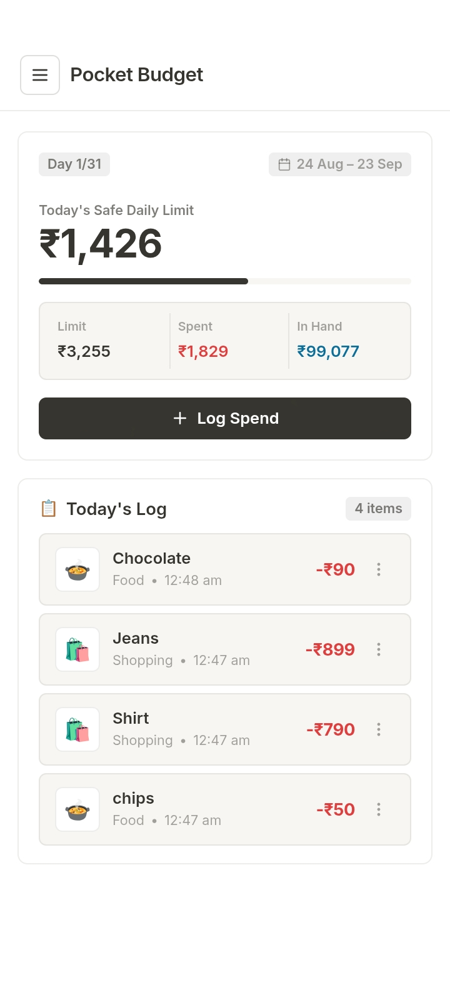</td>
    <td>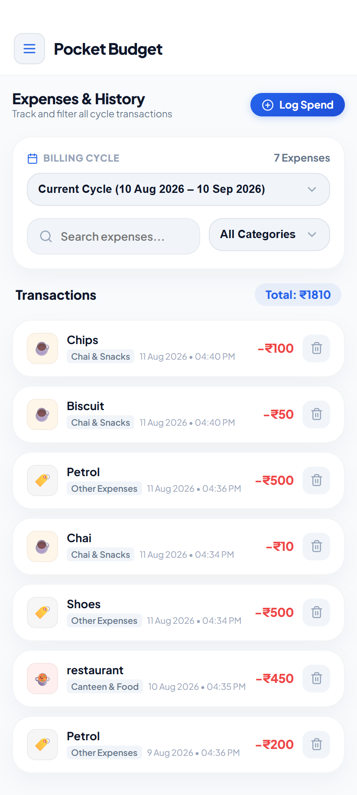</td>
    <td>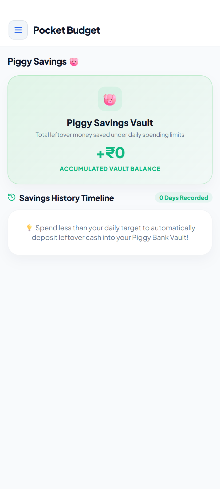</td>
  </tr>
  <tr>
    <td>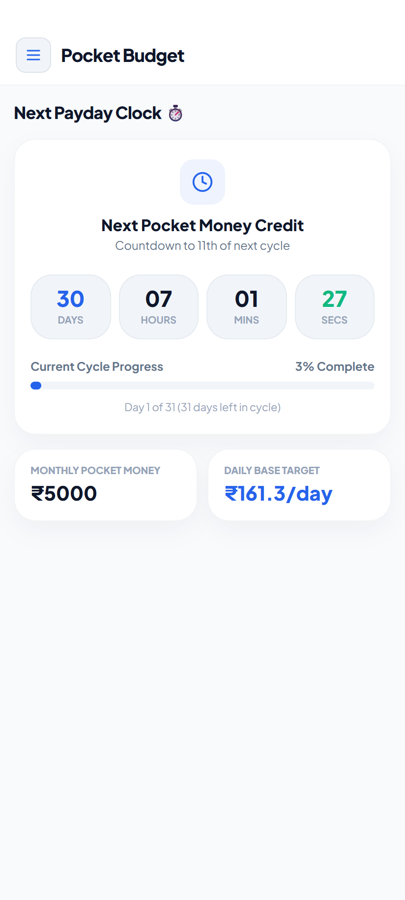</td>
    <td>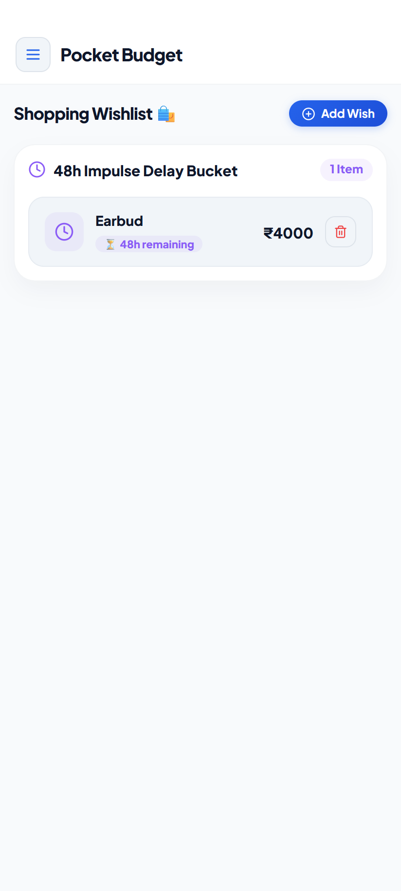</td>
    <td>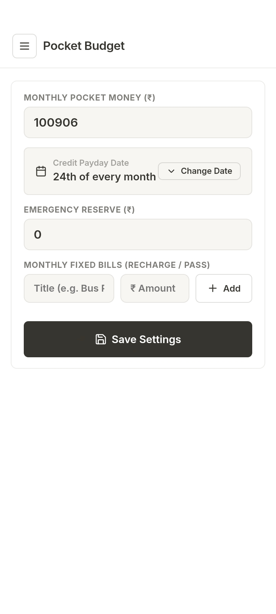</td>
  </tr>
  <tr>
    <td>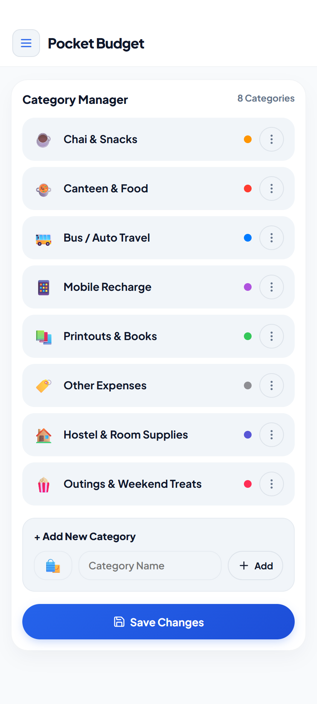</td>
    <td>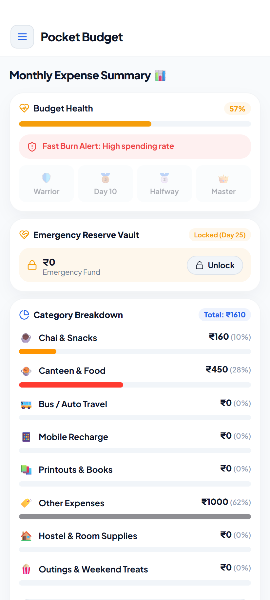</td>
    <td>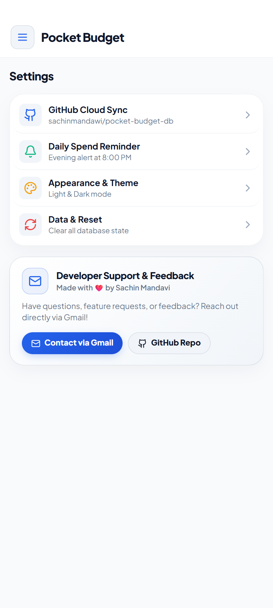</td>
  </tr>
  <tr>
    <td>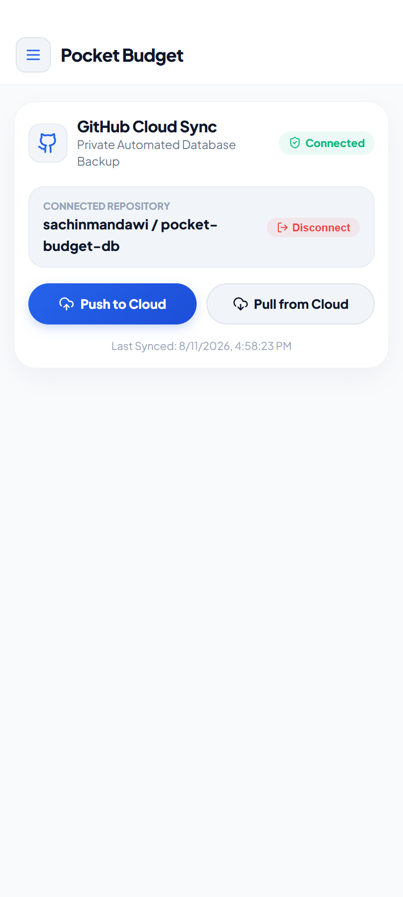</td>
    <td>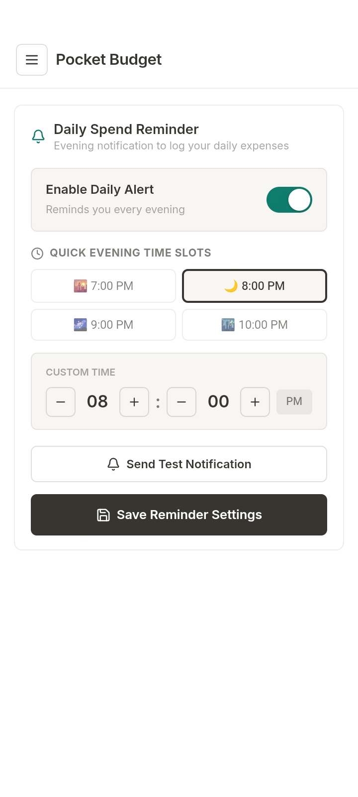</td>
    <td>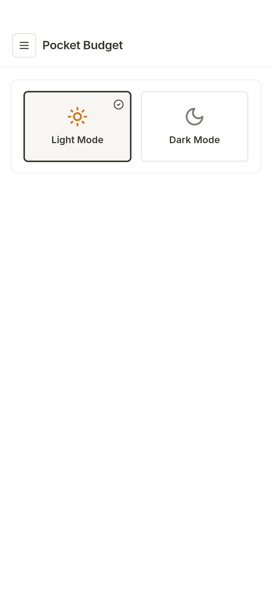</td>
  </tr>
  <tr>
    <td>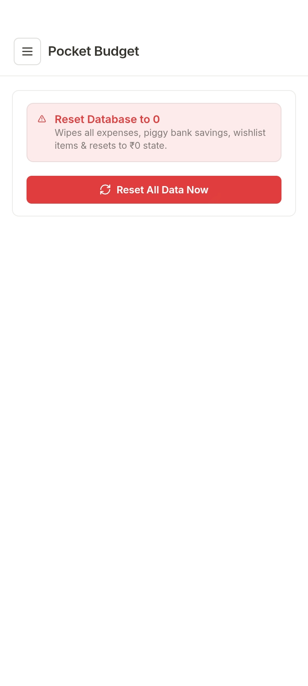</td>
    <td colspan="2"></td>
  </tr>
</table>

---

## 🌟 Key Features

<table align="center">
  <tr>
    <td width="50%" valign="top">
      <h3>👛 Spend Source Selection</h3>
      <p>Log expenses from your <b>Main Daily Allowance</b> or your <b>Piggy Bank Vault</b>. Vault expenses directly deduct from your saved funds without harming your daily allowance!</p>
    </td>
    <td width="50%" valign="top">
      <h3>🐷 Piggy Bank Vault (Option 1)</h3>
      <p>Leftover daily allowance automatically builds up into your <b>Lifetime Piggy Vault</b>. It never resets on payday so you can save for big goals!</p>
    </td>
  </tr>
  <tr>
    <td width="50%" valign="top">
      <h3>⏱️ Allowance Countdown Clock</h3>
      <p>Dedicated digital clock tracking <b>Days, Hours, Minutes, and Seconds</b> remaining until your next monthly payday credit.</p>
    </td>
    <td width="50%" valign="top">
      <h3>🛡️ Smart Over-Draw Protection</h3>
      <p>Real-time balance validation alerts you if your Piggy Vault has insufficient funds and prevents invalid negative balance entries.</p>
    </td>
  </tr>
  <tr>
    <td width="50%" valign="top">
      <h3>📱 Ultra-Clean Minimalist Sidebar</h3>
      <p>100% clutter-free left drawer drawer with dynamic <b>Android Status Bar Safe Area Padding</b> (notch & punch-hole compatible).</p>
    </td>
    <td width="50%" valign="top">
      <h3>☁️ Private GitHub Cloud Database</h3>
      <p>All data syncs directly into your private GitHub repository (<b><code>pocket-budget-db</code></b>). 100% private data ownership with zero 3rd-party servers!</p>
    </td>
  </tr>
</table>

---

## 🎨 Tech Stack & Frameworks

<p align="center">
  
  
  
  
  
</p>

---

## 🛠️ App Architecture & Navigation Flow

```
           ┌─────────────────────────────────────────┐
           │        📱 Pocket Budget App Top         │
           │  (Header Bar + Android Status Bar Pad)  │
           └────────────────────┬────────────────────┘
                                │
             ┌──────────────────┴──────────────────┐
             ▼                                     ▼
   [👈 Left Sidebar Drawer]               [➕ Log Spend Modal]
   ├─ 📊 Daily Dashboard                  ├─ 👛 Main Allowance
   ├─ 🧾 Expenses Log                     ├─ 🐷 Piggy Bank Vault
   ├─ ⏱️ Allowance Countdown              ├─ ⚠️ Real-time Validation
   ├─ 🐷 Piggy Bank Vault                 └─ 💾 Save Expense
   ├─ ❄️ Cool-Off Wishlist
   ├─ 📈 Analytics & Insights
   └─ ⚙️ Settings
```

---

## 📲 Android APK Installation
Download **`PocketBudget-v1.0.0.apk`** from [GitHub Releases](https://github.com/sachinmandawi/pocket-budget-app/releases/tag/v1.0.0) and tap to install on your Android device!

### 💻 Local Development Setup
```bash
# Clone the repository
git clone https://github.com/sachinmandawi/pocket-budget-app.git

# Navigate into project directory
cd pocket-budget-app

# Install dependencies
npm install

# Run dev server
npm run dev
```

---

## 📩 Developer Support & Feedback
Have questions, feature requests, or feedback? Feel free to reach out directly:
- ✉️ **Developer Email**: [sachinmandawi@gmail.com](https://mail.google.com/mail/?view=cm&fs=1&to=sachinmandawi@gmail.com&su=Pocket%20Budget%20App%20Feedback)
- 👨‍💻 **Author**: Sachin Mandavi

---

<div align="center">
  <p>Built with ❤️ by Sachin Mandavi ([sachinmandawi@gmail.com](https://mail.google.com/mail/?view=cm&fs=1&to=sachinmandawi@gmail.com&su=Pocket%20Budget%20App%20Feedback)) • Pocket Budget © 2026</p>
</div>
